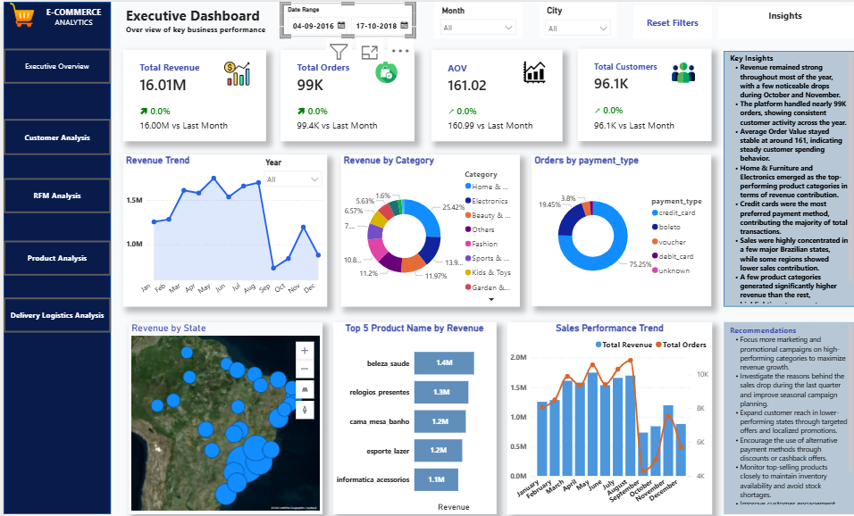
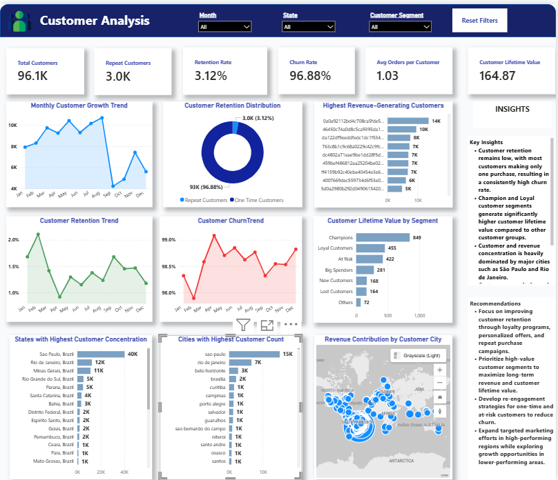
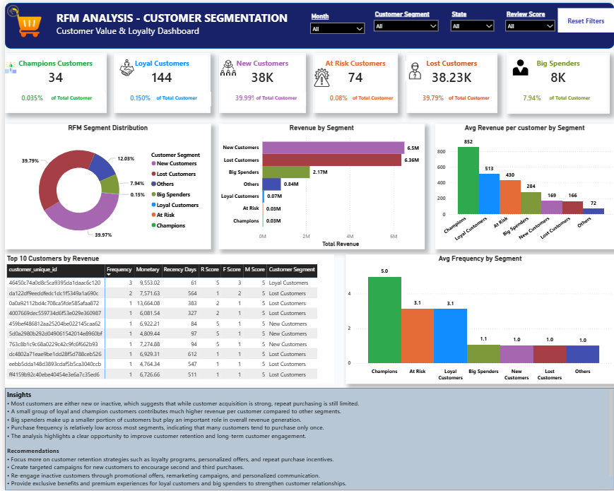
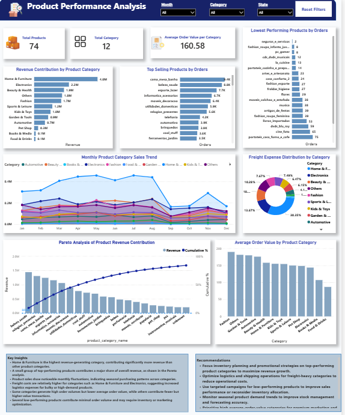
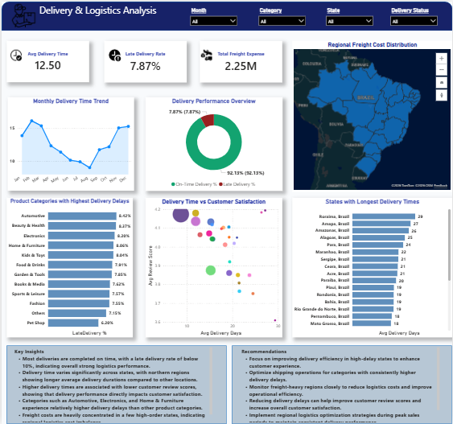
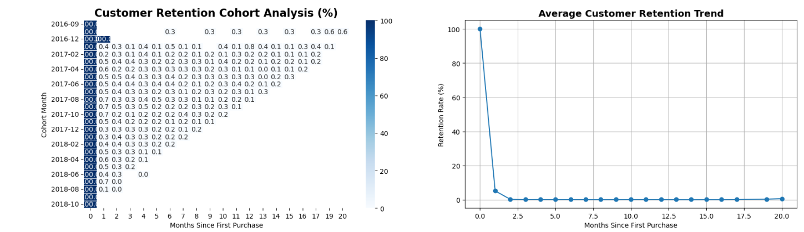

# Brazilian E-Commerce Analytics & Customer Intelligence

## Project Overview

This project is an end-to-end e-commerce analytics and business intelligence solution developed using Python and Power BI with the Brazilian Olist E-Commerce dataset.

The project focuses on transforming raw transactional data into meaningful business insights through data cleaning, preprocessing, exploratory analysis, cohort analysis, customer retention analysis, and interactive dashboard development.

Python was primarily used for data preparation, feature engineering, exploratory analysis, and cohort analysis, while Power BI was used to create interactive business dashboards for reporting and visualization.

---

# Project Objectives

* Clean and preprocess raw e-commerce datasets
* Perform exploratory data analysis (EDA)
* Analyze customer retention and repeat purchase behavior
* Perform cohort analysis using Python
* Build customer segmentation using RFM analysis
* Analyze product and sales performance
* Evaluate delivery and logistics performance
* Develop interactive Power BI dashboards
* Generate actionable business insights

---

# Dataset Information

The project uses the Brazilian Olist E-Commerce dataset containing multiple relational tables, including:

* Customers
* Orders
* Order Items
* Products
* Sellers
* Payments
* Reviews
* Geolocation Data

These datasets were merged and transformed to create a unified analytical dataset for business analysis.

---

# Tools & Technologies Used

## Python

* Pandas
* NumPy
* Matplotlib
* Seaborn
* Jupyter Notebook

## Business Intelligence

* Power BI

## Additional Tools

* Excel

---

# Python Analysis Workflow

## 1. Data Cleaning & Preprocessing

Performed extensive data cleaning and preprocessing using Python to prepare the datasets for analysis.

### Tasks Performed

* Missing value handling
* Duplicate removal
* Data type conversion
* Date formatting
* Invalid record filtering
* Dataset merging
* Data validation
* Relationship consistency checks

---

# 2. Feature Engineering

Created multiple analytical and business-related features such as:

* Delivery Time
* Delivery Delay
* Delivery Status
* Late Delivery Indicator
* Purchase Month & Year
* Product Volume
* Product Size Category
* Review Length
* Cohort Month
* Cohort Index

These features were later used for customer retention analysis, delivery analysis, and dashboard development.

---

# 3. Exploratory Data Analysis (EDA)

Performed exploratory analysis to identify patterns and trends in customer behavior, sales performance, and operational efficiency.

### Analysis Areas

* Revenue trends
* Monthly sales trends
* Customer purchase behavior
* Product category performance
* Freight cost analysis
* Delivery performance trends
* Regional sales distribution

---

# 4. Cohort Analysis & Retention Analysis

Implemented cohort analysis in Python to analyze customer retention and repeat purchase behavior over time.

### Analysis Performed

* Customer cohort grouping
* Retention matrix creation
* Monthly retention tracking
* Repeat purchase analysis
* Cohort size analysis

### Visualizations Created

* Customer Retention Heatmap
* Cohort Size Distribution
* Repeat Purchase Distribution

### Key Insights

* Most customers made only one purchase
* Customer retention decreased significantly after the first purchase
* Only a small percentage of customers became repeat buyers

---

# Power BI Dashboard Development

After completing the data preparation and analysis in Python, the cleaned analytical dataset was used to develop interactive Power BI dashboards for business reporting and visualization.

---

# 1. Executive Dashboard

Created an executive-level overview dashboard to monitor overall business performance.

### Key Metrics

* Total Revenue
* Total Orders
* Average Order Value
* Total Customers
* Revenue Trends
* Payment Analysis
* Regional Sales Distribution

---

# 2. Customer Analysis Dashboard

Built a customer-focused dashboard to analyze customer behavior and retention patterns.

### Analysis Included

* Customer Retention Rate
* Churn Rate
* Repeat Customers
* Customer Lifetime Value
* Customer Growth Trends
* Revenue by Customer Segment

### Key Insights

* Majority of customers were one-time buyers
* Customer retention remained relatively low
* Loyal customers contributed higher revenue compared to other segments

---

# 3. RFM Analysis Dashboard

Performed customer segmentation using RFM (Recency, Frequency, Monetary) analysis.

### Customer Segments

* Champions
* Loyal Customers
* Big Spenders
* New Customers
* At Risk Customers
* Lost Customers

### Key Findings

* Loyal customers generated significant revenue contribution
* A large portion of customers became inactive after their first purchase
* High-value customer segments had strong business impact

---

# 4. Product & Sales Performance Dashboard

Developed dashboards to analyze product performance and revenue contribution.

### Analysis Areas

* Revenue by Product Category
* Top-Selling Products
* Monthly Sales Trends
* Average Order Value
* Pareto Analysis
* Revenue Contribution Analysis

### Insights

* Home & Furniture and Electronics generated high revenue
* Some product categories showed high order volume but lower profitability
* Revenue contribution was concentrated among selected categories

---

# 5. Delivery & Logistics Dashboard

Created dashboards focused on operational and logistics performance.

### Analysis Included

* Delivery Delays
* On-Time Delivery Rate
* Freight Costs
* Regional Delivery Analysis
* State-wise Delivery Performance
* Customer Satisfaction Impact

### Key Insights

* Delivery efficiency varied across regions
* Higher delivery delays negatively impacted customer satisfaction
* Freight expenses were concentrated in high-order regions

---

# Dashboard Preview

## Executive Dashboard

## Customer Analysis Dashboard

## RFM Analysis Dashboard

## Product & Sales Performance Dashboard

## Delivery & Logistics Dashboard

## Cohort Analysis

---

# Key Business Insights

* Customer retention remains a major business challenge with a high percentage of one-time buyers.
* Loyal and high-value customers contribute significantly to overall revenue.
* Product categories such as Home & Furniture and Electronics dominate revenue generation.
* Delivery delays and freight costs vary significantly across states and regions.
* Repeat purchase behavior remains relatively low, highlighting opportunities for customer engagement strategies.

---

# Future Improvements

* Predictive customer churn modeling
* Customer lifetime value prediction
* Sales forecasting
* Recommendation systems
* Real-time dashboard integration

---

# Conclusion

This project demonstrates an end-to-end analytics workflow starting from raw data preprocessing to advanced customer analytics and interactive business intelligence dashboard development.

The combination of Python analytics and Power BI reporting helped generate meaningful insights into customer behavior, sales performance, and operational efficiency within the e-commerce business environment.

---

